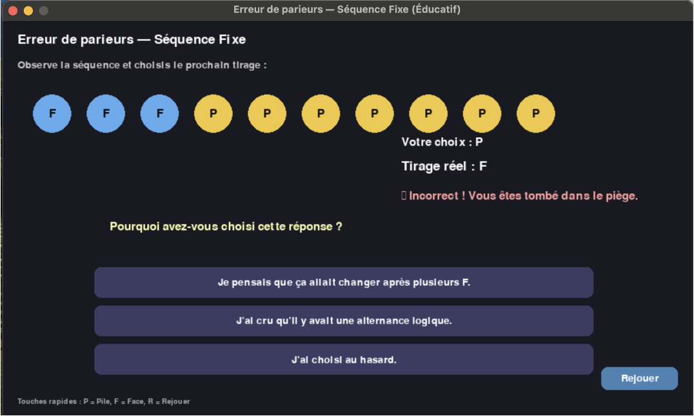

# Escape Game Numérique – Biais Cognitifs

## 🎯 Présentation
Ce projet est un **escape game numérique** conçu lors du **Workshop EPSI/WIS 2025** dans le cadre de la 4ème année.  
Le thème principal est la **santé et les biais cognitifs**. L’objectif est de permettre aux joueurs de comprendre comment fonctionnent certains mécanismes cognitifs et comment ils influencent nos décisions au quotidien, à travers des énigmes interactives.

---

## 🧠 Concepts principaux
**Biais cognitif** :  
Un biais cognitif est une déviation automatique du jugement, influençant la manière dont nous percevons et traitons l’information.  
- Ils sont souvent inconscients.  
- Ils peuvent causer des erreurs de perception ou d’évaluation.  
- Mais ils permettent aussi de **réagir plus rapidement** et de **réduire le coût cognitif**.

---

## 💻 Technologies utilisées
- **Python** et **PyGame** pour les interfaces graphiques.  
- **HTML / CSS** pour certaines consignes et interfaces web.  
- **OpenCV** et **Mediapipe** pour la **reconnaissance faciale**.  
- **SpeechRecognition** pour la **reconnaissance vocale**.  
- **Makey Makey** pour une **interaction physique avec le joueur**.  
- Quelques énigmes sont aussi jouables sur **papier** pour encourager la coopération.

---

## 🎮 Déroulement du jeu
Le joueur incarne un élève-informaticien chargé de remettre en marche un serveur infecté par un virus qui exploite les biais cognitifs.  
Pour avancer, il doit résoudre **4 énigmes** qui illustrent différents biais cognitifs, tout en interagissant avec le serveur et les dispositifs physiques ou numériques.

### 1️⃣ Labyrinthe et Tâche de Wason

### 2️⃣ Le rythme caché

### 3️⃣ L’illusion du hasard

---

## 🧩 Énigmes

### 1️⃣ Labyrinthe et Tâche de Wason
- Objectif : résoudre une tâche logique inspirée de Wason (1960).  
- Principe : les joueurs doivent retourner les bonnes cartes pour valider une règle logique.  
- Interaction : contrôle du labyrinthe à l’aveugle via reconnaissance faciale.  
- But éducatif : comprendre le **sophisme de l’affirmation du conséquent** et développer le raisonnement logique.

### 2️⃣ Le rythme caché
- Objectif : compter mentalement les battements manquants dans une piste musicale.  
- Interaction : utilisation d’un contrôleur physique **Makey Makey** pour modifier un compteur et valider la réponse.  
- Biais mis en évidence : **biais perceptif auditif**, où le cerveau complète mentalement des motifs rythmiques manquants.  
- Méthode : réécouter la piste et soumettre plusieurs fois la réponse pour favoriser l’apprentissage par essais/erreurs.

### 3️⃣ L’illusion du hasard
- Objectif : prédire le prochain tirage “Pile ou Face” après une série d’événements aléatoires.  
- Biais mis en évidence : **biais du joueur (gambler’s fallacy)**.  
- Méthode : le jeu montre que le hasard n’a pas de mémoire et que l’intuition peut être trompeuse.  
- Feedback : messages explicatifs et question réflexive sur le choix effectué par le joueur.

### 4️⃣ Le Jugement Trompeur
- Objectif : identifier la cause de mortalité la plus fréquente dans le monde.  
- Interaction : choix entre plusieurs causes visibles (cancer, accidents, tabac…) et moins visibles (maladies cardiovasculaires).  
- Biais mis en évidence : **biais de disponibilité**.  
- But éducatif : sensibiliser le joueur à la manière dont les informations marquantes influencent notre jugement.

---

## ⚙️ Organisation du travail
Le projet a été réalisé en équipe avec une répartition claire des tâches :  
- Conception des énigmes et narration.  
- Développement Python / PyGame.  
- Intégration des technologies interactives (caméra, son, contrôleur).  
- Design graphique et interface utilisateur.  

---

## ✅ Conclusion
Le projet a permis de combiner **psychologie cognitive, programmation et travail en équipe** dans un cadre ludique et éducatif.  
Il démontre comment les **technologies interactives** peuvent être utilisées pour sensibiliser aux biais cognitifs et encourager la réflexion critique.

---

## 🚀 Pistes d’amélioration
- Intégration d’une **IA pour analyser le comportement des joueurs** et détecter les profils cognitifs.  
- Ajout d’un **narrateur virtuel** (“Dr Cortex”) pour expliquer les biais.  
- Développement d’un **mode multi-biais**, incluant confirmation, ancrage, disponibilité, etc.  
- Collecte de **données anonymisées** pour étudier les tendances cognitives.

---

## 📂 Structure du projet

